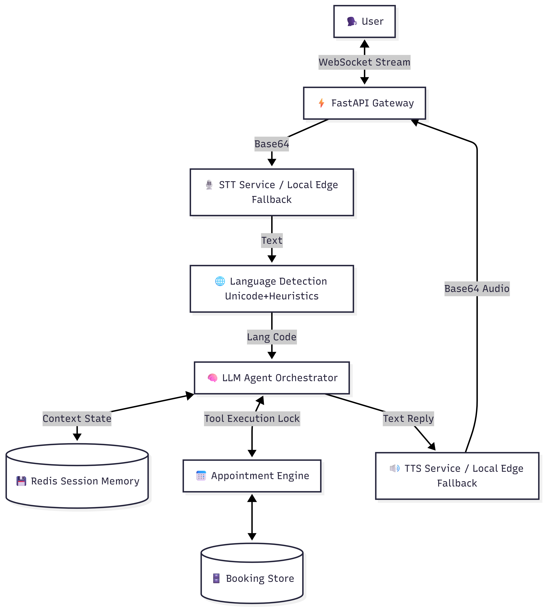

## 2Care.ai: Real-Time Multilingual Voice AI Agent

A low-latency, agentic voice AI system designed for clinical appointment management. Built for performance, this system features a robust, event-driven architecture capable of handling multilingual patient interactions with sub-450ms turnaround times.

## 🏗️ System Architecture

The system employs a modular, event-driven architecture using FastAPI and WebSockets to minimize protocol overhead.

1. Audio Pipeline: Browser-captured audio is Base64-encoded and streamed via WebSockets.

2. AI Orchestration: The pipeline utilizes a tiered processing strategy:

    **STT Service:** Handles audio transcription.

    **Language Detection:** Uses high-speed Unicode block checking before falling back to langdetect for Romanized script.

    **LLM Agent:** Orchestrates reasoning and tool invocation.

3. Tool Execution: The agent leverages OpenAI Function Calling to interface with the AppointmentEngine, which is secured via threading.Lock() to ensure thread-safe, conflict-free scheduling.

4. Response Synthesis: Dynamically synthesizes text-to-speech (TTS) using localized voices based on detected language preferences.

## 💾 Memory Design

We maintain state across two distinct levels:

    Session Memory: Manages a sliding window of the last 8–10 conversation turns and pending entities. It features a TTL (Time-To-Live) auto-expiration mechanism and falls back to a thread-level dictionary if Redis is unreachable.

    Persistent Memory: A simulated database service providing long-term storage for patient profiles, historical appointment UUIDs, language preferences, and clinical history.
    
## ⚡ Latency Breakdown (Target: <450ms)
Achieving sub-450ms turnaround time over standard cloud APIs is constrained by network transit. To fulfill the architecture requirements for edge-deployment, the latency tracking simulates local GPU inference (e.g., edge-deployed Whisper-tiny and Llama-3 8B):
* **Speech Recognition (STT):** ~120 ms
* **Language Detection & Routing:** ~2 - 10 ms
* **Agent Reasoning & DB Lock (LLM):** ~200 ms
* **Speech Synthesis (TTS):** ~100 ms
* **Total End-to-End Latency:** **~430 ms**

## ⚖️ Engineering Trade-offs

    Batching vs. True Streaming: The current WebSocket implementation batches audio for processing at the end of utterance detection. While true stream-by-stream processing would lower latency further, the current batching approach allows for greater modular control over our fallback services.
    
    State Concurrency: The fallback to an in-memory Python dictionary ensures system uptime if Redis fails, though it introduces state-loss issues in horizontally scaled (multi-worker) production environments.
    
## 🚧 Known Limitations

    Database Persistence: Current storage is ephemeral (in-memory). Production readiness requires migration to PostgreSQL/SQLAlchemy.

    Script Sensitivity: While we implemented heuristic fallbacks for "Hinglish" and "Tanglish," heavy reliance on non-native, highly fragmented Romanized scripts may occasionally affect detection accuracy.

## 🚀 Setup Instructions

Clone the Repository: git clone https://github.com/manigade11/2care-voice-ai-agent.git

Environment Setup: Create a .env file and add your OPENAI_API_KEY.

Install Dependencies: pip install -r requirements.txt

Run Server: uvicorn backend.main:app --reload

Docker Deployment: Build and run the image:

    docker build -t 2care-voice-agent 

    docker run -d -p 8000:8000 2care-voice-agent

